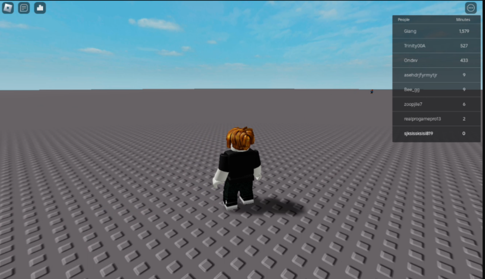

# Roblox Online Website (SelfHost)

**Update as of now I am trying to get keymapping working (webclient almost 90 out of 100 done**

Ever wanted to run roblox in your browser or host private roblox in browser for yourself?
Here it is!

Server Requirements
Recommended Requirements for multiple instances
**16+ GB RAM**
**4+ CPU Threads**
**2 GB of storage per instance**

Mini Server Requirements
Recommended Requirements for private one instance
**4 GB RAM**
**2 CPU Threads**
**2 GB of storage available**
